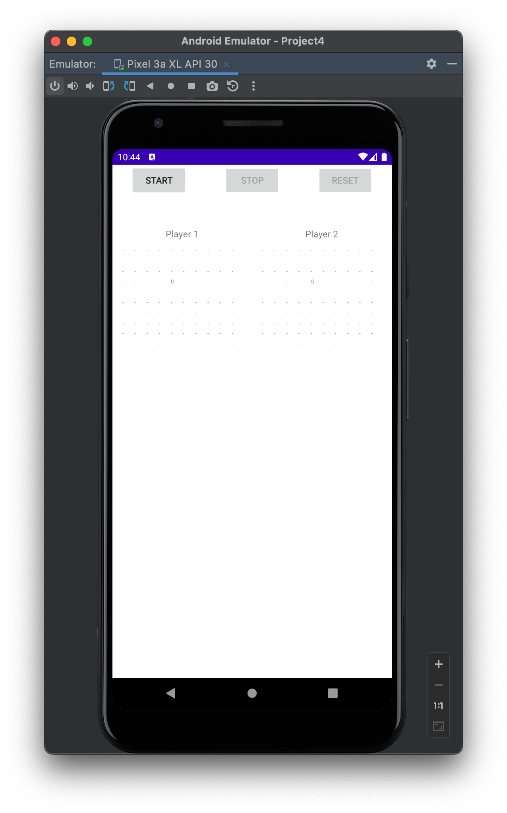

# Gopher Hunting
Android application and multi-threaded grid based game in which the device plays against itself using a smart algorithm. Created using the Android flavor of Java. CS 478 Project 4, UIC Spring 2022.

## Table of contents
* [General Info](#general-info)
* [Getting Started](#getting-started)
* [Project Requirements](#project-requirements)
* [Technologies](#technologies)
* [Credits](#credits)
* [Visual Demonstration](#visual-demonstration)

## General info
This project is the fourth project for CS 478 (Software Development for Mobile Platforms) at the University of Illinois at Chicago, Spring 2022. Our task was to design and code a game of gopher hunting as a self-playing on an Android device running version Android 11 (API 30). Two worker threads play against each other, using algorithms that we designed, in an effort to find the hole that contains the gopher. There are exactly 100 holes in the field; the holes are arranged as a 10×10 matrix and equally spaced with respect to each other. The first thread to find gopher wins the game.

## Getting Started
If you would like to download the app from the Google Play Store, click **here**. If you would like to browse through the source code in the environment it was created in, make sure you have **Android Studio 2021.1.1** installed.
* Windows: [download here](https://redirector.gvt1.com/edgedl/android/studio/install/2021.1.1.20/android-studio-2021.1.1.20-windows.exe)
* Mac (Intel): [download here](https://redirector.gvt1.com/edgedl/android/studio/install/2021.1.1.20/android-studio-2021.1.1.20-mac.dmg)
* Mac (ARM): [download here](https://redirector.gvt1.com/edgedl/android/studio/install/2021.1.1.20/android-studio-2021.1.1.20-mac_arm.dmg)
* Linux: [download here](https://redirector.gvt1.com/edgedl/android/studio/ide-zips/2021.1.1.20/android-studio-2021.1.1.20-linux.tar.gz)
* Chrome OS: [download here](https://redirector.gvt1.com/edgedl/android/studio/install/2021.1.1.20/android-studio-2021.1.1.20-cros.deb)

Once you are ready, open the project in Android Studio. Ensure that the Run/Debug Configurations are set and set the device to a Pixel 3a XL using API 30. The application should load up and look something like this:

*Please note that the "G" (location of the gopher) should be in a random position each time on launch.*

You can then begin watching the device play against itself. You will see 3 buttons at the top: Start, Stop, and Reset. The only button able to be pressed on first launch is "Start", which starts the game. Underneath the buttons is a bit of space alloted for status updates (when the game begins, when the game has stopped, or when a player has won) and underneath that the remainder of the screen space is essentially divided into two halves; one for "Player 1", and one for "Player 2". Once the game has started, the stop button will be enabled, and the game begins. You will see a ListView appear under the grids for each player, detailing the guesses that were made. The items in the ListView will begin with a number, which refers to the **order** of the guesses (0 referring to each player's' first guess, 1 referring to each player's second guess, etc.) and that number will be placed in the position on each player's corresponding grid that was guessed to where the gopher was located (representing the actual guess made).

The user can stop the game once it has begun by pressing stop, and then reset the game if they would like to start again, which should bring about a new gopher location (though there is a small chance it could in the same position, since it is random every time). The ListView shows live feedback during gameplay regarding the status of each guess; whether it is a "Complete Miss", "Close Gues", "Near Miss", or "Success", detailed below:

* **"Success"** means that guess landed on the gopher! 
* **"Near Miss"** means the guess made was adjacent to the position of the gopher.
* **"Close Guess"** means the guess made was adjacent to a *near miss* (2 positions away–excluding adjacency–from the gopher in either a vertical, horizontal, or diagonal direction).
* **"Complete Miss"** will be shown in every other scenario.

## Project Requirements
**Gopher Hunting** was required to support a continuous-play mode whereby the two threads play without interruption until one thread wins the game. Each time a player makes a guess at to the location of the gopher, it receives feedback indicating how close the guess was to the gopher’s location, including whether the gopher’s location was discovered correctly. The UI thread is responsible for setting up the game, starting the worker threads playing against each other, showing the guesses of the two players on two separate tables. We were at liberty to design the app in the way that we found most appropriate, including the number and type of components in the app.

### Other Requirements ###
* The app required three threads, namely the UI thread and two worker threads playing against each other.
* At the beginning of the game, the UI thread should choose a random location for the gopher in the 10x10 matrix.
    * This location is not shared with the worker threads.
* The main activity required button for starting the game and a button for stopping a game.
    * When the user stops the game, the UI thread should send a message to the worker threads indicating that they should terminate themselves.
* The activity showing the game’s progress was required to show two 10x10 tables clearly indicating the progress of each player.
    * Each guess should be clearly marked with a number showing the order of the guesses.
    * In addition, the activity should show the (identical) location of the gopher in both tables.
* Whenever a player thread makes a guess, it pauses (sleeps) for two seconds in order to show its new move on the display. The thead can resume deliberating its next move.
* The sequence of guesses produced by the two players should be different. We were allowed to achieve this goal by using the same algorithm, but using different starting locations.
* Running the app in landscape mode was not required.
    
## Technologies
Project is created with:
* Android Studio Bumblebee 2021.1.1
* Java SE Development Kit (JDK) 11.0.11

## Credits
All credits for the project idea go to Professor Ugo Buy. Credits to the entirety of the codebase go to Abel Abraham. 

All credits to technologies used are given to their owners and all items specified in their respective licenses are adhered to throughout this project.  

## Visual Demonstration
The following link leads to a visual demonstration of the project.
* https://youtu.be/co_mUXC1WNk
